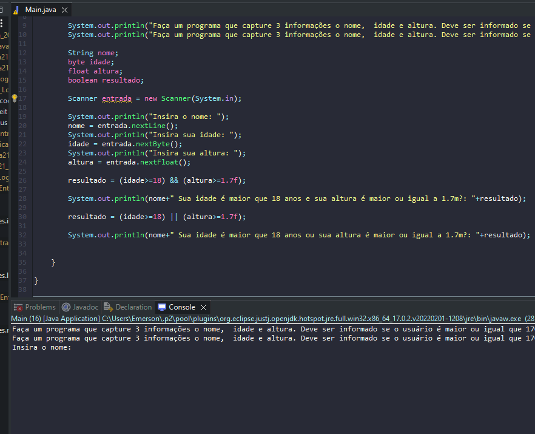

# Exercicio - Operadores Lógicos

> - Faça um programa que capture 3 informações: o nome,  idade e altura. Deve ser informado se o usuário é maior ou igual que 170cm E se é maior de idade (utilizar o &&).
>
> - Faça um programa que capture 3 informações o nome,  idade e altura. Deve ser informado se o usuário é maior ou igual que 170cm OU é maior de idade (utilizar o ||).

## Aplicação em uso.

