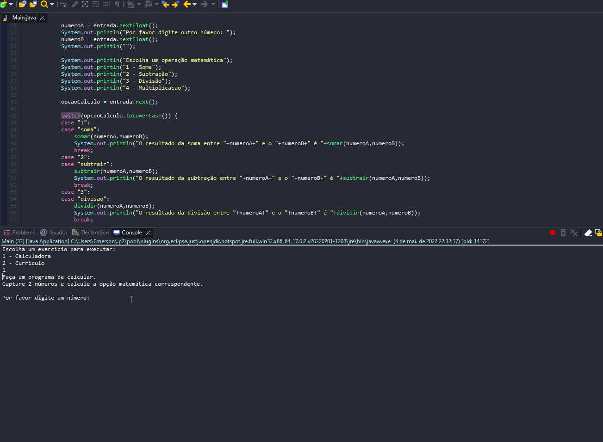

# Exercicio - Função

- Faça um programa que tenha um menu para selecionar entre:
````
    - Uma calculadora com menu para as 4 operações básicas.
    - Um gerador de curriculo.
````


## Aplicação em uso.

